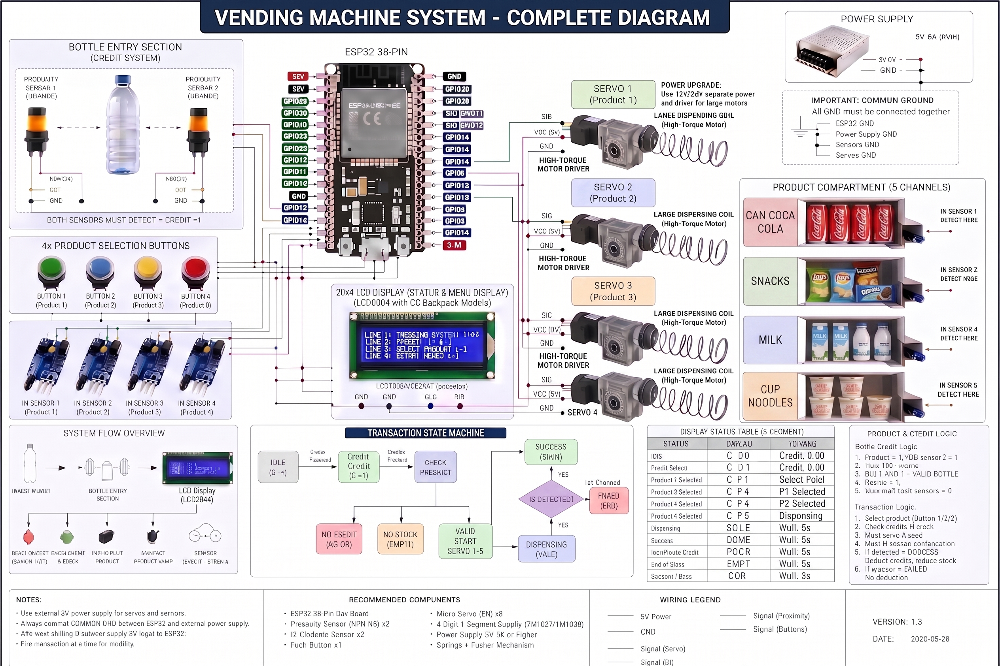

# ESP32 Smart Vending Machine & Inventory Management System

A complete web-based inventory management system and automatic 4-product vending machine hosted directly on an **ESP32 38-Pin Development Board**.

The ESP32 operates in **WiFi Access Point (Hotspot) mode** and acts as both the Web Server and the Hardware Controller — no external router or internet required!

---

## 📐 Complete System Architecture & Wiring Diagram



---

## 🌟 Key Features

- **Stand-alone WiFi Hotspot & Web Server:** Connect directly to `ESP32-Inventory` WiFi and open `http://192.168.4.1`.
- **4-Product Dispensing System:**
  - **4x Selection Push Buttons** (with 50ms software debouncing).
  - **4x High-Torque Servos / Spring Dispensing Coils** (with 5-second stall protection timeout).
  - **4x Product Drop IR Sensors:** Kapag may na-detect na object ang kahit alin sa apat habang nagdi-dispense, agad hihinto ang lahat ng servos; saka lamang ibabawas ang credit at stock ng napiling product.
- **Three-Sensor Bottle Credit System with Tube Door:**
  - The front/entry sensor must first be clear; while it detects a bottle, no credit is awarded.
  - Sensor A (Upper) + Sensor B (Lower) must then detect the bottle simultaneously to award `+1 Credit`.
  - A 180-degree door servo at the end of the tube opens immediately before the credit is awarded, then closes after the bottle clears the tube.
  - Anti-double counting lock prevents multiple credits from a single bottle.
- **20×4 I2C Status Display (PCF8574):**
  - Shows credits, product selection, dispensing progress, successful delivery, insufficient-credit, out-of-stock, and error messages across four 20-character lines.
- **Web-Based GPIO Pin Management:**
  - Fully reconfigurable GPIO pins directly from the web browser (`Configuration` page).
  - Saved persistently to `/pins.json` in LittleFS and applied live to hardware without re-flashing!
- **Persistent Storage:**
  - Product database and stock saved in **LittleFS** (`/products.json`).
  - Administrator credentials stored in **ESP32 NVS/Preferences** partition.
- **Modern Responsive Web UI:** Real-time dashboard, product CRUD, dynamic pricing (in credits/₱), stock tracking, and account security.

---

## 📂 Project Structure

```text
ESP32_Smart_Vending_Machine/
├── ArduinoSmartVendingMachine.ino  <- Main sketch (or ESP32_Inventory_System.ino)
├── config.h                        <- Hotspot settings & default GPIO pin definitions
├── pin_config.h / .cpp             <- Dynamic GPIO pin storage & live manager (/pins.json)
├── vending_controller.h / .cpp     <- State machine, three-sensor bottle logic, tube door, buttons & servos
├── display_manager.h / .cpp        <- 20×4 I2C LCD (PCF8574) status display
├── wifi_manager.h / .cpp           <- WiFi Access Point (Hotspot) handler
├── storage.h / .cpp                <- LittleFS filesystem helper
├── auth.h / .cpp                   <- NVS admin authentication & session tokens
├── products.h / .cpp               <- Product CRUD database & LittleFS persistence
├── api.h / .cpp                    <- REST API endpoints & route handlers
├── connection.md                   <- Complete hardware wiring & manual setup guide
├── Plan.jpg                        <- Complete visual circuit & mechanical diagram
└── data/                           <- Web frontend assets (HTML, CSS, JS)
    ├── index.html
    ├── login.html
    ├── dashboard.html
    ├── products.html
    ├── configuration.html
    ├── css/
    │   └── style.css
    └── js/
        ├── auth.js
        ├── dashboard.js
        ├── products.js
        └── configuration.js
```

---

## 🔌 Default GPIO Pin Mapping (4 Products)

| Component | Default GPIO | Type | Description |
|:---|:---|:---|:---|
| **Bottle Sensor (Tube Front / Entry)** | `GPIO 36` / `VP` | Input only | Blocks credit validation while a bottle is at the tube entry |
| **Bottle Sensor A (Upper)** | `GPIO 34` / `P34` | Input | Proximity sensor A |
| **Bottle Sensor B (Lower)** | `GPIO 35` / `P35` | Input | Proximity sensor B |
| **Button 1 (Product 1)** | `GPIO 13` / `P13` | Input (Pull-up) | Push button for Product 1 |
| **Button 2 (Product 2)** | `GPIO 14` / `P14` | Input (Pull-up) | Push button for Product 2 |
| **Button 3 (Product 3)** | `GPIO 27` / `P27` | Input (Pull-up) | Push button for Product 3 |
| **Button 4 (Product 4)** | `GPIO 26` / `P26` | Input (Pull-up) | Push button for Product 4 |
| **IR Drop Sensor 1** | `GPIO 16` / `P16` | Input | Any active IR sensor stops all servos |
| **IR Drop Sensor 2** | `GPIO 17` / `P17` | Input | Any active IR sensor stops all servos |
| **IR Drop Sensor 3** | `GPIO 32` / `P32` | Input | Any active IR sensor stops all servos |
| **IR Drop Sensor 4** | `GPIO 33` / `P33` | Input | Any active IR sensor stops all servos |
| **Servo 1 (Motor 1)** | `GPIO 18` / `P18` | PWM Out | Spring coil dispenser 1 |
| **Servo 2 (Motor 2)** | `GPIO 19` / `P19` | PWM Out | Spring coil dispenser 2 |
| **Servo 3 (Motor 3)** | `GPIO 21` / `P21` | PWM Out | Spring coil dispenser 3 |
| **Servo 4 (Motor 4)** | `GPIO 25` / `P25` | PWM Out | Spring coil dispenser 4 |
| **Door Servo (Tube End)** | `GPIO 4` / `P4` | PWM Out | 180-degree door that holds/releases the bottle |
| **20×4 I2C LCD (SDA)** | `GPIO 23` / `P23` | I2C Data | PCF8574 serial adapter |
| **20×4 I2C LCD (SCL)** | `GPIO 22` / `P22` | I2C Clock | PCF8574 serial adapter |

> 💡 *Note: All pins above can be modified via the Web Dashboard without re-flashing!*

> **Board labels:** Sa ESP32 38-pin board, ang `Pxx` ay katumbas ng `GPIO xx`; `VP` ay `GPIO 36`. Ginagamit ang VP para sa front/entry sensor lamang dahil input-only ito. Ang IR sensors ay nasa `P16`, `P17`, `P32`, at `P33`. Huwag gamitin ang `SD0`, `SD1`, `SD2`, `SD3`, `CMD`, o `CLK` dahil ginagamit ang mga ito ng flash memory.

---

## ⚡ Power Supply & Common Ground

```text
               +-------------------------------------------------------+
               |               EXTERNAL 5V POWER SUPPLY                |
               |                   (5V, 3A to 6A)                      |
               +---------------------------+---------------------------+
                                           |
               +5V (RED)                   | GND (BLACK)
               |                           |
               +-------+-------+-------+---+--------------------+
               |       |       |       |                        |
          +----+---+ +-+--+--+ +-+--+--+ +-+--+--+              |
          | SERVO 1| |SERVO 2| |SERVO 3| |SERVO 4|              |
          +----+---+ +-+--+--+ +-+--+--+ +-+--+--+              |
               |       |       |       |                        |
               | Signals (GPIO)|       |                        |
               |       |       |       |                        |
     +---------+-------+-------+-------+------------------------+-------------+
     |      GPIO 18 GPIO 19 GPIO 21 GPIO 25                                   |
     |                                                   COMMON GND (BLACK)   |
     |                                                          |             |
     |                            ESP32 38-PIN BOARD         [ GND ]          |
     +------------------------------------------------------------------------+
```

* **Servos:** Powered via external 5V 3A–6A power supply.
* **Common Ground:** Connect the External Power Supply **GND** to the **ESP32 GND**.

---

## 🚀 Setup & Upload Instructions (Arduino IDE)

1. Open **Arduino IDE**.
2. Open [`ArduinoSmartVendingMachine.ino`](ArduinoSmartVendingMachine.ino) (or [`ESP32_Inventory_System.ino`](ESP32_Inventory_System.ino)).
3. Install required libraries from Library Manager (`Ctrl + Shift + I`):
   - **`ArduinoJson`** by *Benoît Blanchon* (v7.x)
   - **`AsyncTCP`** by *ESP32Async*
   - **`ESPAsyncWebServer`** by *ESP32Async*
4. Select board **DOIT ESP32 DEVKIT V1** and your COM Port.
5. Click **Upload (➡)** to flash the sketch.
6. Upload the `data/` folder to LittleFS using the Arduino IDE LittleFS upload tool (*Tools → ESP32 LittleFS Data Upload* or *Upload LittleFS*).

---

## 📱 How to Use & Connect

1. Power on the ESP32 and external motor power supply.
2. Connect your phone, tablet, or PC to the WiFi network:
   - **WiFi Name (SSID):** `ESP32-Inventory`
   - **WiFi Password:** `inventory123` *(or open if configured with `""`)*
3. Open any web browser and go to:
   ```text
   http://192.168.4.1
   ```
4. Log in with the default administrator credentials:
   - **Username:** `admin`
   - **Password:** `admin123`

---

## 📖 Additional Documentation

- **[`connection.md`](connection.md)** — Complete step-by-step wiring guide, level shifting, and physical assembly procedures.
- **[`Vending_Machine_Plan.md`](Vending_Machine_Plan.md)** — Technical design specifications and transaction state machine documentation.
